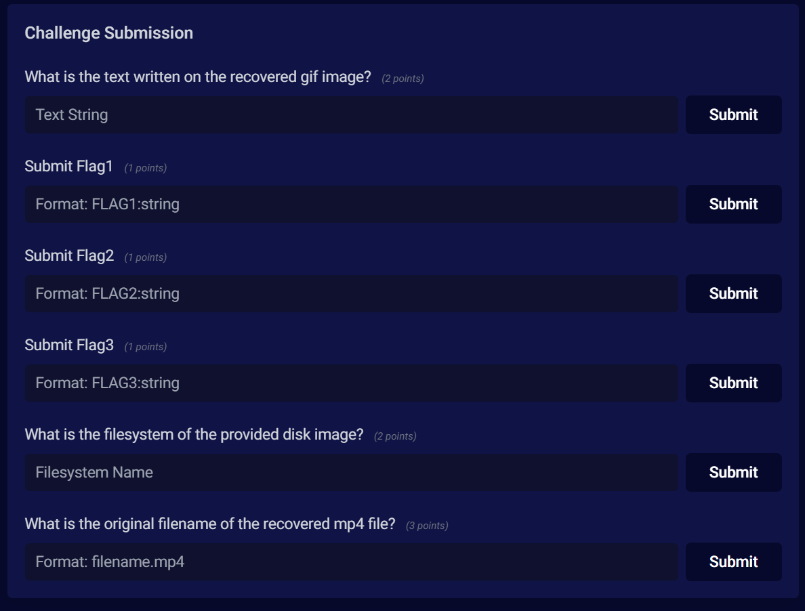
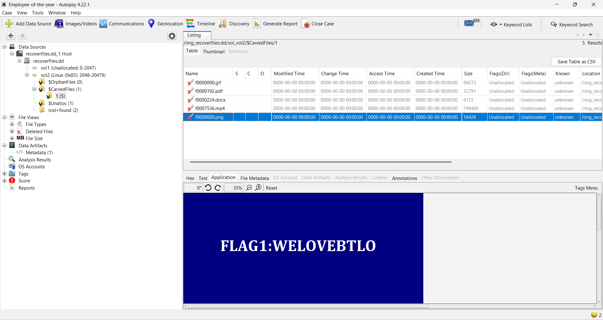
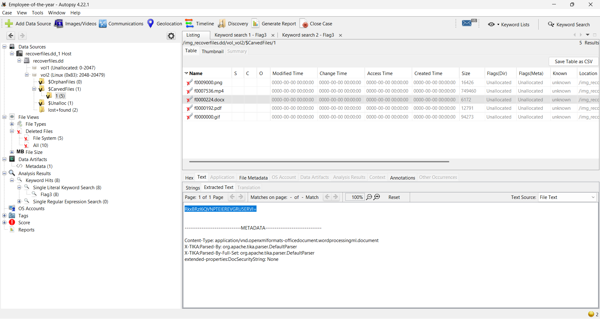
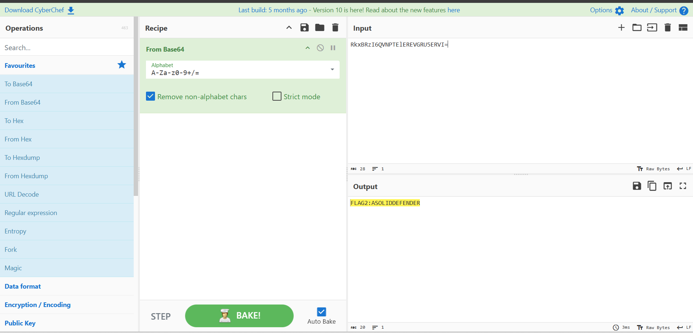
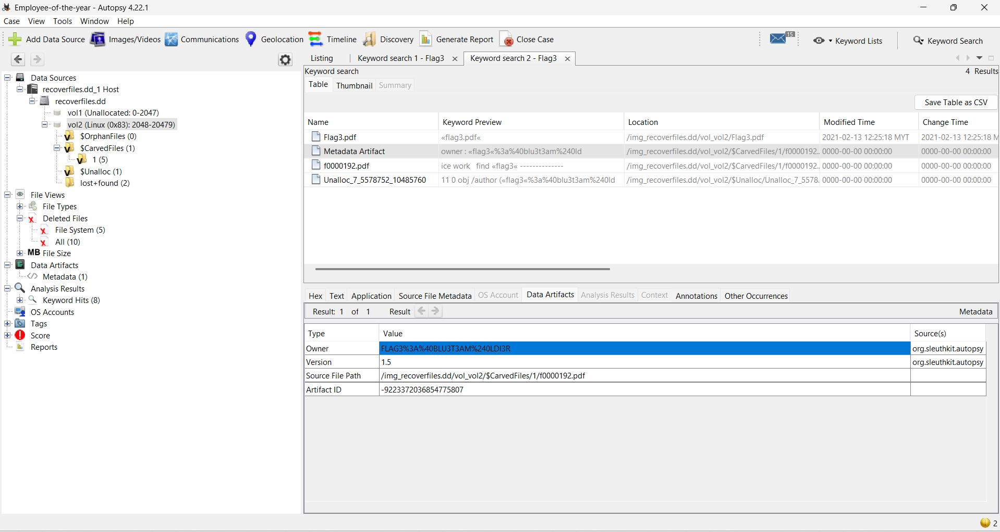
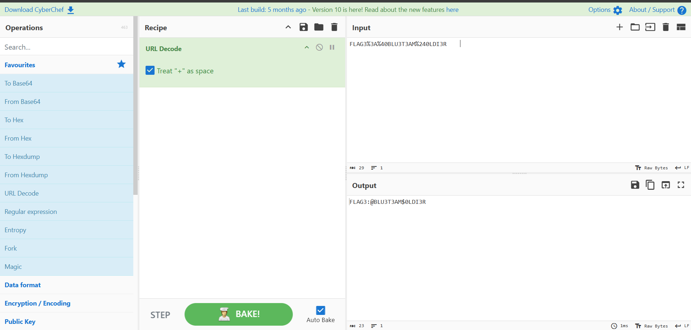
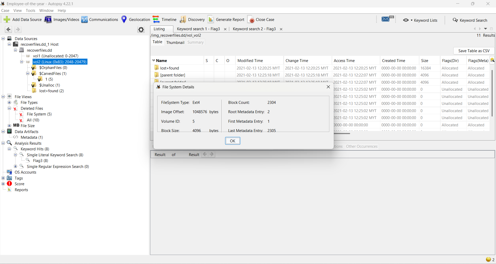
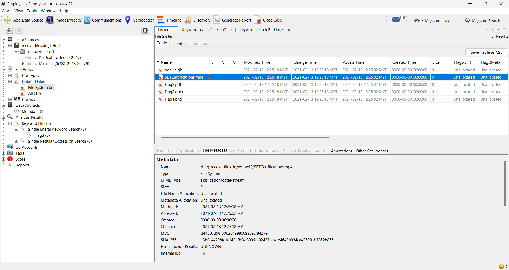

# BlueTeamLabs

## 📑 Table of Contents

- [CTF-Like](#ctf-like)
  - [Employee Of The Year](#Employee-Of-The-Year)

## CTF-Like

### Employee Of The Year

Description:
John received the Best Employee of the Year award for his hard work at FakeCompany Ltd. Unfortunately, today John deleted some important files (typical John!).
It’s our job to recover the deleted files and capture all the flags contained within.

#### What is the text written on the recovered gif image?
First, I loaded the .dd file into Autopsy.

After that, I noticed there were multiple deleted files.
I checked the deleted GIF file and opened it using Autopsy.

From the GIF image, I got the flag.

#### 🚩 Flag: GoodJobDefender
#

#### Submit Flag1 
Next, I checked each deleted file one by one.
I found a PNG file and opened it in Autopsy.

The flag was clearly visible inside the image.

#### 🚩 Flag: FLAG1:WELOVEBTLO
#

####Submit flag2
Then, I found a DOCX file.
Inside the document, there was a suspicious Base64 encoded string.

I copied the Base64 string and decoded it using CyberChef.
After decoding, I obtained the flag.

#### 🚩 Flag: FLAG2:ASOLIDDEFENDER
#

#### Submit flag3
To find Flag 3, I searched for the keyword "flag3" using Autopsy’s search bar.

After checking the files one by one, I found a flag pattern in the Owner metadata of the following file:
/img_recoverfiles.dd/vol_vol2/$CarvedFiles/1/f0000192.pdf

The value was URL-encoded: FLAG3%3A%40BLU3T3AM%240LDI3R

I decoded it using CyberChef and got the final flag.

#### 🚩 Flag: FLAG3:@BLU3T3AM$0LDI3R
#

#### What is the filesystem of the provided disk image? 

I right-clicked on vol2 (Linux (0x83): 2048–20479) and selected File System Details.

From there, I got the answer.

#### 🚩 Flag: ext4
#

#### What is the original filename of the recovered mp4 file?
I navigated to: File Views > Deleted Files > File System

From there, I found the original filename of the recovered MP4 file.

#### 🚩 Flag: SBTCertifications.mp4
#
